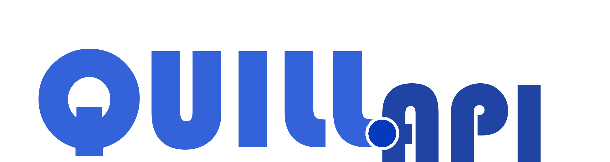

## Documentation

- On the official website or the GitHub page.
[DOCKS](https://doge-productions.github.io/Quil.api/docks)

## Roadmap

- [ ] Proxy Support For reading network traffic.
- [X] Dynamic Client instance.
- [X] Threads.
- [X] Gifs. Aperently already supported!
- [ ] DM messaging.
- [ ] Changing profile info.
- [ ] creating polls
- [ ] Changing who can reply.
- [ ] groups and lists support.
- [ ] IDK coming up with more things to do.

## The Gang

We are all a couple of bored teenagers in school, so don't expect there to be rollouts every week or something like that. Although we are in school, when summer rolls around, we will be able to make more frequent changes to this project. 

Oh, also this is a simple fun project. Twitter, please don't take action against us 🥺 I'm begging.

## Feedback

If you have any feedback, please reach out to us at dogeproduce@gmail.com or through the issues tab.

© 2023 DogeProductions. All rights reserved. 